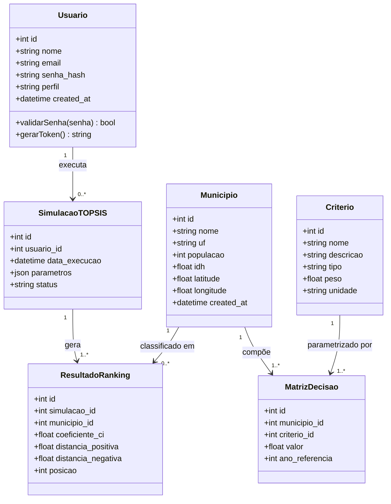
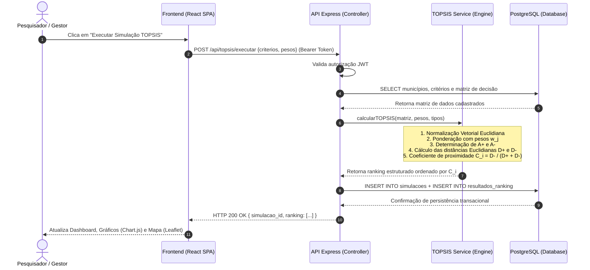
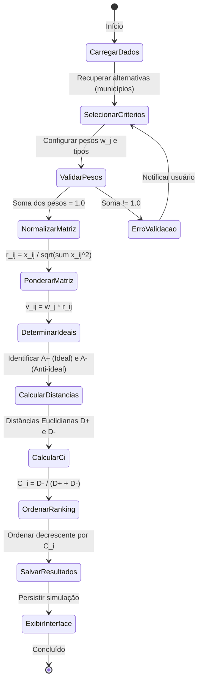
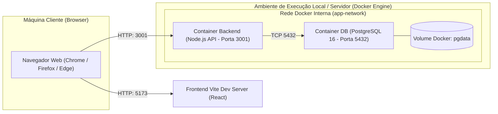

# Modelagem UML Completa do Sistema

**Projeto:** Plataforma de Vulnerabilidade Social Energética com TOPSIS  
**Engenharia da Computação — Disciplina de Desenvolvimento Web**  

---

## 1. Diagrama de Casos de Uso

```mermaid
flowchart LR
    Admin((Administrador))
    Pesquisador((Pesquisador))
    Gestor((Gestor Público))

    subgraph Plataforma TOPSIS
        UC01[UC01 - Cadastrar / Manter Municípios]
        UC02[UC02 - Configurar Critérios e Pesos TOPSIS]
        UC03[UC03 - Executar Cálculo TOPSIS e Gerar Ranking]
        UC04[UC04 - Exportar Relatório PDF / CSV]
        UC05[UC05 - Autenticar Usuário via JWT]
        UC06[UC06 - Consultar Dashboard e Mapa Interativo]
    end

    Admin --> UC01
    Admin --> UC05
    Pesquisador --> UC02
    Pesquisador --> UC03
    Pesquisador --> UC05
    Pesquisador --> UC06
    Gestor --> UC03
    Gestor --> UC04
    Gestor --> UC06
    Gestor --> UC05

    UC03 ..> UC02 : <<include>>
```

### Especificação Textual dos Principais Casos de Uso:
- **UC01 - Cadastrar Município:**
  - *Ator:* Administrador
  - *Pré-condição:* Usuário autenticado
  - *Fluxo principal:*
    1. Ator seleciona "Novo Município";
    2. Sistema exibe formulário de entrada;
    3. Ator insere nome, UF, população, IDH e coordenadas geográficas;
    4. Sistema valida unicidade e consistência dos tipos;
    5. Sistema persiste na base de dados relacional e retorna código 201 com confirmação.
- **UC02 - Configurar Critérios TOPSIS:**
  - *Ator:* Pesquisador / Administrador
  - *Fluxo principal:*
    1. Ator ajusta sliders de pesos e tipos (`beneficio` ou `custo`);
    2. Sistema valida soma normalizada ($\sum w_j = 1,0$);
    3. Sistema atualiza parametrização da sessão de cálculo.
- **UC03 - Executar TOPSIS:**
  - *Ator:* Pesquisador / Gestor Público
  - *Fluxo principal:*
    1. Usuário clica em "Executar Simulação";
    2. Backend monta a matriz de decisão com os valores normalizados dos municípios;
    3. Motor calcula soluções ideais e coeficiente $C_i$;
    4. Backend persiste a simulação e os resultados no banco;
    5. Ranking ordenado decrescente é retornado para exibição.
- **UC04 - Exportar Relatório:**
  - *Ator:* Gestor Público
  - *Fluxo principal:* Usuário seleciona exportação em CSV ou impressão para relatório formal de apoio a políticas energéticas.

---

## 2. Diagrama de Classes



---

## 3. Diagrama de Sequência — Execução do Algoritmo TOPSIS



---

## 4. Diagrama de Atividades — Ciclo de Decisão Multicritério



---

## 5. Diagrama de Componentes

```mermaid
flowchart TB
    subgraph FrontendSPA ["Frontend SPA (React + Vite)"]
        UI_Dash["Dashboard & KPIs"]
        UI_Map["Mapa Interativo (Leaflet)"]
        UI_Charts["Visualizador Gráfico (Chart.js)"]
        UI_Forms["Formulários & Sliders TOPSIS"]
        API_Client["API Client / Axios Service"]
    end

    subgraph BackendAPI ["Backend REST API (Node.js + Express)"]
        Auth_MW["Auth Middleware (JWT/bcrypt)"]
        Routers["Rotas REST (Municípios, Critérios, Simulações)"]
        Controllers["Controllers (MVC)"]
        Engine["TOPSIS Engine (Service puro)"]
        Repo["Data Access Layer (pg pool)"]
        Swagger["OpenAPI / Swagger UI"]
    end

    subgraph Persistence ["Camada de Persistência (Docker)"]
        Postgres[("PostgreSQL 16 + PostGIS")]
    end

    UI_Forms --> API_Client
    UI_Dash --> API_Client
    UI_Map --> API_Client
    UI_Charts --> API_Client

    API_Client -->|HTTP / JSON (REST)| Auth_MW
    Auth_MW --> Routers
    Routers --> Controllers
    Controllers --> Engine
    Controllers --> Repo
    Repo -->|TCP / SQL Connection Pool| Postgres
    Routers --> Swagger
```

---

## 6. Diagrama de Implantação


